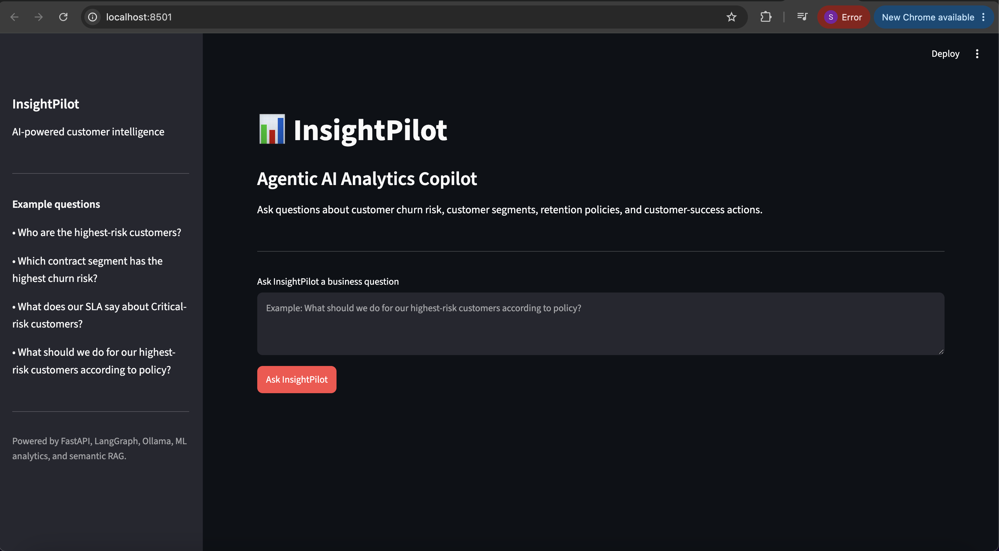
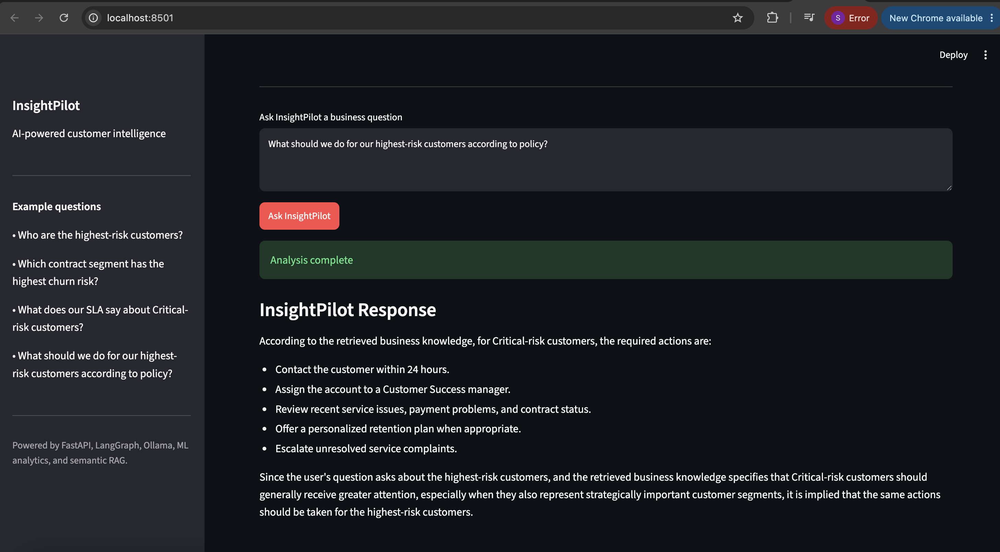
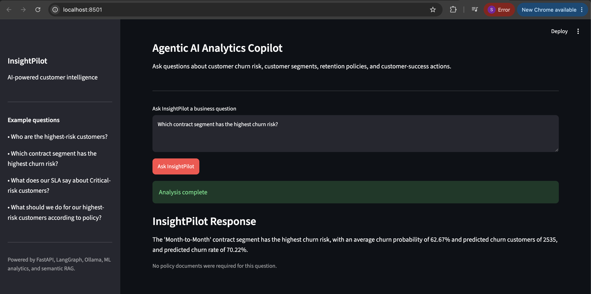

# InsightPilot

**Agentic AI Analytics Copilot for Customer Churn Intelligence**

InsightPilot is an end-to-end AI analytics application that combines machine learning, customer risk scoring, segment analysis, semantic RAG, LangGraph routing, FastAPI, Ollama, and Streamlit.

The project is designed to answer business questions such as:

- Who are the highest-risk customers?
- Which customer segment has the highest churn risk?
- What does our SLA say about Critical-risk customers?
- What should we do for our highest-risk customers according to policy?

---

## Overview

InsightPilot combines structured customer analytics with retrieval-augmented generation to provide grounded, business-focused answers.

Instead of sending every question through the same workflow, the LangGraph agent classifies each question and routes it to the appropriate analysis path.

Supported routes:

- **Customer Risk**
- **Segment Analysis**
- **Policy / RAG**
- **Combined Analytics + RAG**

This allows InsightPilot to use only the tools and context required for each question.

---

## Application Preview

### Home






---

## Key Features

### Customer 360 Analytics

Builds a consolidated customer-level dataset by combining demographics, location, services, account status, and population information.

The final Customer 360 dataset contains one record per customer and is used throughout the analytics and machine-learning pipeline.

---

### Churn Feature Engineering

Creates model-ready features such as:

- customer tenure
- contract characteristics
- payment behavior
- internet service information
- estimated lifetime billing
- new-customer indicators
- month-to-month contract indicators
- population enrichment

---

### Leakage-Controlled Churn Model

InsightPilot uses a logistic regression churn model with:

- median imputation for numerical features
- most-frequent imputation for categorical features
- numerical standardization
- one-hot encoding
- class balancing
- stratified train/test split

Potential target-leakage and post-outcome variables are excluded before training.

Model performance on the held-out test set:

- **Accuracy:** ~80.6%
- **Churn Recall:** ~86.6%
- **Churn Precision:** ~59.2%
- **Churn F1 Score:** ~70.4%

The relatively high recall is useful for retention scenarios where identifying customers at churn risk is important.

---

### Model Explainability

The logistic regression coefficients are extracted and transformed into human-readable churn signals.

The application distinguishes between:

- signals associated with higher modeled churn risk
- signals associated with lower modeled churn risk

These signals are treated as predictive associations rather than causal relationships.

---

### Customer Risk Scoring

Each customer receives:

- churn probability
- churn probability percentage
- predicted churn label
- risk tier

Risk tiers:

| Risk Tier | Churn Probability |
|---|---:|
| Critical | 80% or higher |
| High | 60%–79.99% |
| Medium | 40%–59.99% |
| Low | Below 40% |

Current scored customer population:

- **Total customers:** 7,043
- **Critical risk:** 1,346
- **High risk:** 989
- **Medium risk:** 799
- **Low risk:** 3,909
- **High or Critical:** 2,335
- **High or Critical share:** 33.15%
- **Average churn probability:** 38.29%

---

## Segment Analytics

InsightPilot can compare churn risk across business segments such as:

- contract type
- payment method
- internet type

Example result:

**Month-to-Month** customers were identified as the highest-risk contract segment in the current modeled dataset.

Observed metrics:

- average churn probability: ~62.67%
- predicted churn rate: ~70.22%
- predicted churn customers: 2,535

The agent uses these metrics to support retention prioritization questions.

---

## Agentic Question Routing

InsightPilot uses LangGraph to classify questions before analysis.

Example routes:

```text
"Who are the highest-risk customers?"
→ customer

"Which contract segment has the highest churn risk?"
→ segment

"What does our SLA say about Critical-risk customers?"
→ policy

"What should we do for our highest-risk customers according to policy?"
→ combined